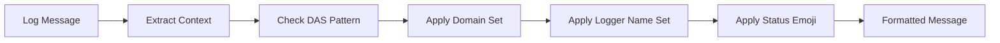

# Emoji System Specification

The emoji system provides visual enhancement for structured logging through contextual emoji prefixes, enabling rapid visual parsing of log streams and improved developer experience.

## Overview

Foundation's emoji system transforms structured log messages from this:

```
2024-01-15 10:30:45.123 [INFO] user_authentication_completed user_id=usr_123 method=oauth duration_ms=245
```

Into this:

```
2024-01-15 10:30:45.123 [INFO] 🔐✅ user_authentication_completed user_id=usr_123 method=oauth duration_ms=245
```

The system provides:
- **Visual Parsing**: Quick identification of log types through emojis
- **Domain Context**: Domain-specific emoji sets (HTTP, Database, LLM, etc.)
- **Status Indication**: Success/failure/warning visual cues
- **Customization**: User-defined emoji mappings

## Architecture

### Emoji Resolution Pipeline



### Resolution Order

1. **Domain-Action-Status (DAS) Mapping** - Event-specific emojis
2. **Domain Emoji Sets** - Domain-specific mappings (HTTP, DB, LLM)
3. **Logger Name Mapping** - Logger hierarchy-based emojis
4. **Level Fallback** - Default level-based emojis

## Domain-Action-Status (DAS) System

### Pattern Recognition

The system recognizes structured event names following the DAS pattern:

```
{domain}_{action}_{status}
```

**Examples**:
- `user_authentication_completed` → 🔐✅
- `database_connection_failed` → 🗄️❌  
- `http_request_started` → 📥⏳
- `payment_processing_warning` → 💰⚠️

### Status Emoji Mapping

| Status Pattern | Emoji | Meaning |
|---------------|-------|---------|
| `_completed`, `_success` | ✅ | Successful completion |
| `_failed`, `_error` | ❌ | Failure or error |
| `_started`, `_begin` | ⏳ | Operation in progress |
| `_warning`, `_alert` | ⚠️ | Warning condition |
| `_cancelled`, `_aborted` | ⏹️ | Cancelled operation |
| `_timeout`, `_expired` | ⏰ | Timeout condition |

## Domain Emoji Sets

### HTTP Domain Set

**Event Patterns**: `http_*`, `api_*`, `request_*`, `response_*`

```python
HTTP_EMOJI_SET = {
    "request": "📥",      # Incoming request
    "response": "📤",     # Outgoing response  
    "get": "📖",          # GET request
    "post": "📝",         # POST request
    "put": "📄",          # PUT request
    "delete": "🗑️",      # DELETE request
    "patch": "✏️",        # PATCH request
    "cors": "🌐",         # CORS handling
    "auth": "🔐",         # Authentication
    "middleware": "🔗",   # Middleware processing
    "routing": "🧭",      # Request routing
}
```

**Example Usage**:
```
📥✅ http_request_completed method=GET path=/users status=200 duration_ms=45
📝⏳ api_user_creation_started user_data={"email": "user@example.com"}
🔐❌ http_authentication_failed reason=invalid_token ip=192.168.1.100
```

### Database Domain Set

**Event Patterns**: `database_*`, `db_*`, `sql_*`, `query_*`

```python
DATABASE_EMOJI_SET = {
    "connection": "🔗",   # Database connections
    "query": "🔍",        # SELECT queries
    "insert": "➕",       # INSERT operations
    "update": "✏️",       # UPDATE operations  
    "delete": "➖",       # DELETE operations
    "transaction": "🔄",  # Transactions
    "migration": "🔄",    # Schema migrations
    "backup": "💾",       # Backup operations
    "index": "📇",        # Index operations
    "lock": "🔒",         # Table locks
}
```

**Example Usage**:
```
🔗✅ database_connection_established host=localhost port=5432 database=myapp
🔍⏳ db_user_query_started table=users filters={"active": true}
➕❌ sql_insert_failed table=orders error=constraint_violation
```

### LLM Domain Set

**Event Patterns**: `llm_*`, `ai_*`, `model_*`, `completion_*`

```python
LLM_EMOJI_SET = {
    "completion": "🤖",   # Text completion
    "embedding": "🧠",    # Embeddings
    "tokenize": "✂️",     # Tokenization
    "prompt": "💭",       # Prompt processing
    "inference": "🔮",    # Model inference
    "training": "🎓",     # Model training
    "fine_tune": "🎯",    # Fine-tuning
    "cache": "💾",        # Response caching
    "rate_limit": "⏱️",   # Rate limiting
    "cost": "💰",         # Cost tracking
}
```

**Example Usage**:
```
🤖✅ llm_completion_completed model=gpt-4 tokens=150 duration_ms=1200
💭⏳ ai_prompt_processing_started user_id=usr_123 prompt_length=500
💰⚠️ llm_cost_threshold_warning daily_cost=45.67 threshold=50.00
```

### Task Queue Domain Set

**Event Patterns**: `task_*`, `job_*`, `queue_*`, `worker_*`

```python
TASK_QUEUE_EMOJI_SET = {
    "enqueue": "📥",      # Task queued
    "dequeue": "📤",      # Task dequeued
    "process": "⚙️",      # Task processing
    "worker": "👷",       # Worker operations
    "retry": "🔄",        # Task retry
    "schedule": "📅",     # Scheduled tasks
    "priority": "⭐",     # Priority handling
    "batch": "📦",        # Batch processing
    "dead_letter": "💀",  # Dead letter queue
    "heartbeat": "💓",    # Worker heartbeat
}
```

**Example Usage**:
```
📥✅ task_enqueue_completed task_id=tsk_123 queue=high_priority
👷⏳ worker_task_processing_started worker_id=wrk_456 task_type=email
🔄⚠️ job_retry_warning task_id=tsk_789 attempt=3 max_retries=5
```

## Logger Name Emoji Mapping

### Automatic Logger Mapping

Logger names are automatically mapped to contextual emojis:

```python
LOGGER_NAME_EMOJI_MAP = {
    "auth": "🔐",         # Authentication
    "database": "🗄️",    # Database operations
    "api": "🌐",          # API operations
    "cache": "💾",        # Caching
    "queue": "📥",        # Message queues
    "worker": "👷",       # Background workers
    "scheduler": "⏰",    # Task scheduling
    "monitoring": "📊",   # Monitoring/metrics
    "security": "🛡️",    # Security operations
    "payment": "💰",      # Payment processing
    "email": "📧",        # Email operations
    "file": "📁",         # File operations
    "config": "⚙️",       # Configuration
    "test": "🧪",         # Testing
}
```

**Hierarchical Matching**:
```python
# Logger: "myapp.auth.jwt"
# Matches: "auth" → 🔐

# Logger: "myapp.database.users"  
# Matches: "database" → 🗄️

# Logger: "myapp.api.v1.users"
# Matches: "api" → 🌐
```

### Custom Logger Mappings

```python
from provide.foundation import TelemetryConfig, LoggingConfig

config = TelemetryConfig(
    logging=LoggingConfig(
        custom_emoji_sets=[{
            "enabled": True,
            "logger_name_mapping": {
                "billing": "💰",
                "notifications": "🔔",
                "analytics": "📈"
            }
        }]
    )
)
```

## Level-Based Fallback Emojis

When no domain or logger mapping is found:

| Log Level | Emoji | Alt Emoji |
|-----------|-------|-----------|
| `TRACE` | 🔍 | 👁️ |
| `DEBUG` | 🐛 | 🔧 |
| `INFO` | ℹ️ | 📝 |
| `WARNING` | ⚠️ | 🚨 |
| `ERROR` | ❌ | 🔥 |
| `CRITICAL` | 🚨 | 💥 |

## Performance Considerations

### Emoji Resolution Performance

- **Lookup Time**: O(1) for exact matches, O(log n) for pattern matching
- **Memory Usage**: ~50KB for all default emoji sets
- **Caching**: Results cached per unique logger/event combination

### Performance Optimization

```python
# Disable emojis in production for maximum performance
config = LoggingConfig(
    das_emoji_prefix_enabled=False,
    logger_name_emoji_prefix_enabled=False
)

# Or use environment variable
export PROVIDE_LOG_DAS_EMOJI_ENABLED=false
```

### Benchmark Results

| Configuration | Throughput (msg/sec) | Overhead |
|--------------|---------------------|----------|
| No emojis | 16,500 | 0% |
| DAS only | 14,200 | 14% |
| Logger + DAS | 13,800 | 16% |
| All emoji sets | 12,900 | 22% |

## Configuration

### Environment Variables

```bash
# Enable/disable emoji systems
export PROVIDE_LOG_DAS_EMOJI_ENABLED=true
export PROVIDE_LOG_LOGGER_NAME_EMOJI_ENABLED=true

# Select emoji sets
export PROVIDE_LOG_ENABLED_EMOJI_SETS="http,database,llm"

# Custom emoji sets (JSON)
export PROVIDE_LOG_CUSTOM_EMOJI_SETS='[{
  "enabled": true,
  "das_mapping": {
    "payment_completed": "💰✅",
    "user_created": "👤✅"
  }
}]'
```

### Programmatic Configuration

```python
from provide.foundation import TelemetryConfig, LoggingConfig

config = TelemetryConfig(
    logging=LoggingConfig(
        # Enable/disable emoji features
        das_emoji_prefix_enabled=True,        # DAS pattern emojis
        logger_name_emoji_prefix_enabled=True, # Logger name emojis
        
        # Select emoji sets to enable
        enabled_emoji_sets=["http", "database", "llm"],
        
        # Custom emoji mappings
        custom_emoji_sets=[{
            "enabled": True,
            "das_mapping": {
                "payment_processing_completed": "💰✅",
                "user_signup_failed": "👤❌"
            },
            "logger_name_mapping": {
                "billing": "💰",
                "notifications": "🔔"
            }
        }]
    )
)
```

## See Also

- [Telemetry Format](telemetry-format.md) - Message structure specification
- [Emoji Sets](emoji-sets.md) - Domain-specific emoji implementations  
- [Performance Architecture](performance.md) - Performance impact analysis
- [Logging Guide](../guide/logging/) - Using emojis in practice
