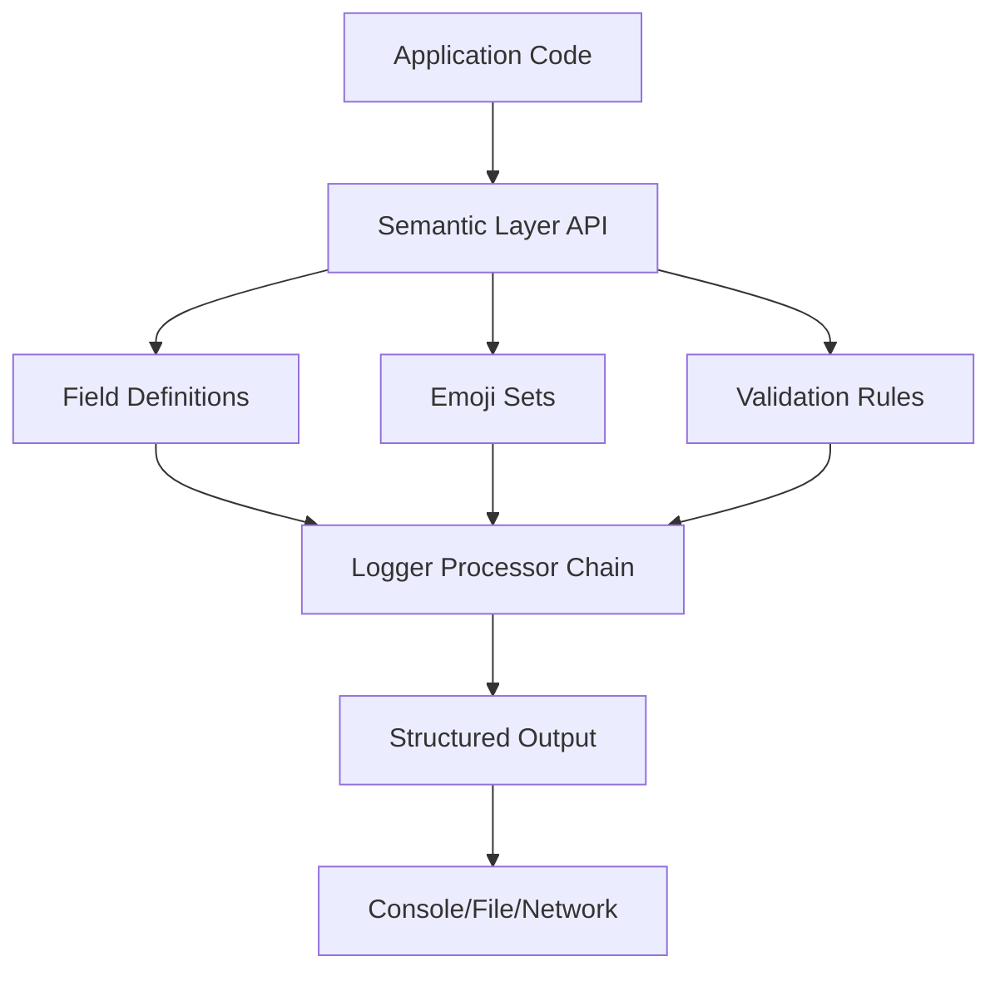

# Semantic Layer Architecture

Technical implementation details of provide.foundation's domain-specific telemetry interfaces.

## System Overview



## Core Components

### 1. SemanticLayer Class

The base class that defines a semantic layer:

```python
@attrs.define(frozen=True, kw_only=True)
class SemanticLayer:
    """Defines a semantic telemetry layer."""
    
    name: str                                    # e.g., "http", "llm", "database"
    description: str                             # Human-readable description
    emoji_sets: list[CustomDasEmojiSet]        # Domain-specific emoji mappings
    field_definitions: list[SemanticFieldDefinition]  # Field specifications
    priority: int = 50                          # Processing priority (higher = first)
```

### 2. Field Definitions

Each field in a semantic layer is precisely defined:

```python
@attrs.define(frozen=True, kw_only=True)
class SemanticFieldDefinition:
    """Defines a semantic field with metadata."""
    
    log_key: str                    # e.g., "http.method", "llm.provider"
    description: str = ""            # Field documentation
    value_type: str = "string"       # Expected type: string|integer|float|boolean
    emoji_set_name: str | None = None  # Links to emoji set for mapping
    default_emoji_override_key: str | None = None  # Fallback emoji key
    required: bool = False           # Whether field is mandatory
    validation_regex: str | None = None  # Optional validation pattern
```

### 3. Emoji Mapping System

Dynamic emoji assignment based on field values:

```python
@attrs.define(frozen=True, kw_only=True)
class CustomDasEmojiSet:
    """Emoji set for domain-action-status mapping."""
    
    name: str                        # Unique identifier
    emojis: dict[str, str]          # Value -> Emoji mapping
    default_emoji_key: str = "default"  # Fallback key
    
    def get_emoji(self, key: str) -> str:
        """Get emoji with fallback to default."""
        return self.emojis.get(key, self.emojis.get(self.default_emoji_key, ""))
```

## Built-in Layer Specifications

### HTTP Layer Architecture

```python
HTTP_LAYER = SemanticLayer(
    name="http",
    priority=80,  # High priority for web apps
    emoji_sets=[
        # Method-specific emojis
        CustomDasEmojiSet(
            name="http_method",
            emojis={
                "get": "📥",     # Receiving data
                "post": "📤",    # Sending data
                "put": "📝⬆️",   # Updating
                "delete": "🗑️",  # Removing
                "patch": "🩹",   # Partial update
            }
        ),
        # Status class emojis
        CustomDasEmojiSet(
            name="http_status_class",
            emojis={
                "2xx": "✅",     # Success
                "3xx": "↪️",     # Redirect
                "4xx": "⚠️",     # Client error
                "5xx": "🔥",     # Server error
            }
        )
    ]
)
```

### LLM Layer Architecture

```python
LLM_LAYER = SemanticLayer(
    name="llm",
    priority=100,  # Highest priority for AI-focused apps
    emoji_sets=[
        # Provider-specific branding
        CustomDasEmojiSet(
            name="llm_provider",
            emojis={
                "openai": "🤖",
                "anthropic": "📚",
                "google": "🇬",
                "meta": "🦙",
            }
        ),
        # Task visualization
        CustomDasEmojiSet(
            name="llm_task",
            emojis={
                "generation": "✍️",
                "embedding": "🔗",
                "chat": "💬",
                "tool_use": "🛠️",
            }
        )
    ]
)
```

## Processing Pipeline

### 1. Layer Registration

Layers are registered at initialization:

```python
BUILTIN_SEMANTIC_LAYERS: dict[str, SemanticLayer] = {
    "llm": LLM_LAYER,
    "database": DATABASE_LAYER,
    "http": HTTP_LAYER,
    "task_queue": TASK_QUEUE_LAYER,
}

# Sorted by priority for processing order
ACTIVE_LAYERS = sorted(
    BUILTIN_SEMANTIC_LAYERS.values(),
    key=lambda x: x.priority,
    reverse=True
)
```

### 2. Field Processing

When a log event occurs:

1. **Field Extraction**: Extract semantic fields from event dict
2. **Layer Matching**: Find appropriate layer based on field keys
3. **Emoji Resolution**: Map field values to emojis
4. **Validation**: Ensure field types and constraints
5. **Enrichment**: Add layer metadata

```python
def process_semantic_fields(event_dict: dict[str, Any]) -> dict[str, Any]:
    """Process event through semantic layers."""
    
    # Find matching layer
    layer = find_matching_layer(event_dict)
    if not layer:
        return event_dict
    
    # Apply field definitions
    for field_def in layer.field_definitions:
        if field_def.log_key in event_dict:
            # Validate type
            validate_field_type(event_dict[field_def.log_key], field_def.value_type)
            
            # Apply emoji if configured
            if field_def.emoji_set_name:
                emoji = resolve_emoji(
                    event_dict[field_def.log_key],
                    layer.get_emoji_set(field_def.emoji_set_name)
                )
                event_dict["_emoji"] = emoji
    
    return event_dict
```

### 3. Emoji Prefix Addition

The final processor adds emojis to the message:

```python
def add_emoji_prefix(event_dict: dict[str, Any]) -> str:
    """Add emoji prefix to log message."""
    
    emoji = event_dict.pop("_emoji", "")
    message = event_dict.get("event", "")
    
    if emoji:
        return f"{emoji} {message}"
    return message
```

## Performance Optimizations

### 1. Lazy Layer Loading

Layers are only loaded when first used:

```python
class LazyLayerRegistry:
    def __init__(self):
        self._layers: dict[str, SemanticLayer] | None = None
    
    @property
    def layers(self) -> dict[str, SemanticLayer]:
        if self._layers is None:
            self._layers = self._load_layers()
        return self._layers
```

### 2. Emoji Caching

Emoji lookups are cached for performance:

```python
@lru_cache(maxsize=1024)
def get_emoji_for_value(
    value: str,
    emoji_set_name: str,
    layer_name: str
) -> str:
    """Cached emoji lookup."""
    layer = BUILTIN_SEMANTIC_LAYERS[layer_name]
    emoji_set = layer.get_emoji_set(emoji_set_name)
    return emoji_set.get_emoji(value)
```

### 3. Field Key Indexing

Fields are indexed by prefix for fast matching:

```python
FIELD_PREFIX_INDEX = {
    "http.": HTTP_LAYER,
    "db.": DATABASE_LAYER,
    "llm.": LLM_LAYER,
    "task.": TASK_QUEUE_LAYER,
}

def find_layer_for_event(event_dict: dict[str, Any]) -> SemanticLayer | None:
    """Fast layer lookup using prefix index."""
    for key in event_dict:
        for prefix, layer in FIELD_PREFIX_INDEX.items():
            if key.startswith(prefix):
                return layer
    return None
```

## Extensibility

### Custom Layer Registration

Applications can register custom layers:

```python
from provide.foundation.semantic_layers import register_layer

@register_layer
class PaymentLayer(SemanticLayer):
    name = "payment"
    priority = 75
    # ... configuration ...

# Or programmatically
register_semantic_layer(PAYMENT_LAYER)
```

### Layer Composition

Layers can be composed for complex scenarios:

```python
# Combine HTTP + LLM for AI API calls
class AIAPILayer(CompositeSemanticLayer):
    layers = [HTTP_LAYER, LLM_LAYER]
    
    def process(self, event_dict):
        # Apply both HTTP and LLM semantics
        event_dict = HTTP_LAYER.process(event_dict)
        event_dict = LLM_LAYER.process(event_dict)
        return event_dict
```

## Configuration & Control

### Runtime Configuration

```python
# Global configuration
TelemetryConfig(
    enable_semantic_layers=True,
    enabled_layers=["http", "llm"],  # Selective enabling
    semantic_layer_timeout_ms=10,    # Processing timeout
)

# Per-logger configuration
logger = get_logger(
    semantic_layers_enabled=False  # Disable for performance-critical paths
)
```

### Performance Monitoring

```python
# Track layer processing time
LAYER_METRICS = {
    "http": {"count": 0, "total_ms": 0},
    "llm": {"count": 0, "total_ms": 0},
}

def track_layer_performance(layer_name: str, duration_ms: float):
    LAYER_METRICS[layer_name]["count"] += 1
    LAYER_METRICS[layer_name]["total_ms"] += duration_ms
```

## Thread Safety

All semantic layer operations are thread-safe:

```python
# Immutable configuration
@attrs.define(frozen=True)  # Frozen = immutable
class SemanticLayer:
    ...

# Thread-local storage for context
THREAD_LOCAL = threading.local()

def with_semantic_context(**kwargs):
    """Thread-safe context manager."""
    THREAD_LOCAL.semantic_context = kwargs
    try:
        yield
    finally:
        THREAD_LOCAL.semantic_context = None
```

## Integration Points

### With Structlog Processors

Semantic layers integrate seamlessly with structlog's processor chain:

```python
structlog.configure(
    processors=[
        structlog.stdlib.add_log_level,
        semantic_layer_processor,  # Our semantic layer
        add_emoji_prefix,          # Emoji addition
        structlog.processors.JSONRenderer(),
    ]
)
```

### With OpenTelemetry

Semantic layers are designed to **extend and enhance OpenTelemetry**, not replace it:

```python
from opentelemetry import trace, metrics
from provide.foundation.otel import SemanticOTELProcessor

# Semantic layers automatically enrich OTEL spans
tracer = trace.get_tracer(__name__)

class SemanticOTELProcessor:
    """Bridges semantic layers with OpenTelemetry."""
    
    def process_span(self, span: Span, event_dict: dict[str, Any]):
        """Enrich OTEL span with semantic layer data."""
        
        # Direct OTEL attribute mapping (already compatible!)
        for key, value in event_dict.items():
            if key.startswith(("http.", "db.", "rpc.", "messaging.")):
                span.set_attribute(key, value)
        
        # Add provide.io-specific attributes
        if "_semantic_layer" in event_dict:
            span.set_attribute("provide.semantic_layer", event_dict["_semantic_layer"])
        
        # Visual parsing in span events (not attributes)
        if "_emoji" in event_dict:
            span.add_event(f"{event_dict['_emoji']} {event_dict.get('event', '')}")
        
        return span

# Automatic OTEL integration
@with_otel_span("http.request")
def handle_request(request):
    # Semantic layers enhance the OTEL span
    logger.info("http_request_started",
        **{
            "http.method": request.method,        # OTEL standard
            "http.url": request.url,              # OTEL standard
            "http.route": request.route,          # OTEL standard
            "provide.request_id": request.id,     # provide.io addition
        }
    )
    # Creates OTEL span with all attributes + visual logging
```

### Distributed Tracing Integration

```python
from provide.foundation.otel import setup_tracing

# Configure OTEL with semantic layer enhancement
setup_tracing(
    endpoint="otel-collector:4317",
    service_name="my-service",
    semantic_layers_enabled=True,  # Enable semantic enrichment
    visual_span_events=True,        # Add emoji events to spans
)

# Automatic trace context propagation
with tracer.start_as_current_span("process_order") as span:
    logger.info("order_processing",
        order_id="123",
        # Semantic layer adds emoji + validates fields
        # OTEL span gets all attributes
    )
```

## Design Decisions

### Why Extend OpenTelemetry?

1. **Standards compliance**: OTEL is the industry standard for observability
2. **Visual enhancement**: We add developer-friendly emoji on top of OTEL
3. **Ecosystem integration**: provide.io services need both OTEL and visual logging
4. **Progressive enhancement**: Start with our logging, seamlessly add OTEL when needed

### Architecture Benefits

1. **No lock-in**: Can export to any OTEL-compatible backend
2. **Best of both worlds**: Visual local development + standard production observability
3. **Gradual adoption**: Use semantic layers alone, or with full OTEL
4. **Forward compatible**: As OTEL evolves, we evolve with it

### Why Domain-Specific?

1. **Context awareness**: HTTP logs differ from database logs
2. **Field validation**: Each domain has specific requirements
3. **Visual distinction**: Different emoji sets per domain
4. **Future extensibility**: Easy to add new domains

### Why Emoji Mapping?

1. **Visual scanning**: 10x faster pattern recognition
2. **Error detection**: 🔥 stands out immediately
3. **Domain identification**: 🤖 = AI, 🌐 = Web, 🗄️ = Database
4. **Developer experience**: More engaging and memorable logs

## Next Steps

- 📖 [Creating Custom Layers](../tutorials/custom-semantic-layer.md)
- 🔧 [API Reference](../api/semantic/index.md)
- 📚 [Usage Examples](../cookbook/recipes/index.md)
- 🎨 [Emoji System Details](emoji-system.md)