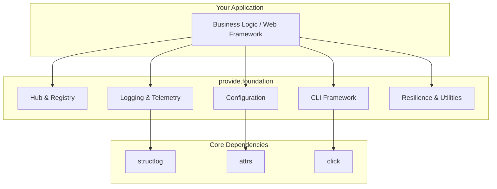

# Explanation: Architecture

`provide.foundation` is designed as a layered, framework-agnostic library that provides common infrastructure for building high-quality Python applications.

## Core Modules

-   **Logging & Telemetry (`logger`, `tracer`, `metrics`):** Built on `structlog`, this system provides high-performance, structured logging with a powerful event enrichment system for visual parsing.

-   **Configuration (`config`):** A type-safe configuration system built on `attrs`. It loads settings from multiple sources (environment variables, files) with a clear order of precedence.

-   **Hub & Registry (`hub`):** The architectural core. The `Hub` acts as a service locator and dependency injection (DI) container, managing the lifecycle of components and discovering CLI commands.

-   **CLI Framework (`cli`):** A declarative framework for building command-line interfaces, built on `click`.

-   **Resilience & Utilities (`resilience`, `errors`, `file`, `crypto`):** A "batteries-included" toolkit for common needs, including resilience patterns (`@retry`, `@circuit_breaker`), structured error handling, and safe utilities.

## Design Principles

-   **Opinionated Core Stack:** The framework is tightly integrated with a curated set of best-in-class libraries (`structlog`, `attrs`, `click`) to provide a cohesive, "it-just-works" experience.

-   **Developer Experience First:** APIs are designed to be ergonomic and intuitive. Decorators and type hints are used extensively to reduce boilerplate.

-   **Production-Ready by Default:** Features like structured JSON logging, thread safety, and resilience patterns are built-in.
