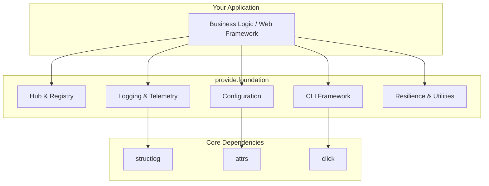

# Explanation: Architecture

`provide.foundation` is designed as a layered, framework-agnostic library that provides common infrastructure for building high-quality Python applications.

## Core Modules

-   **Logging & Telemetry (`logger`, `tracer`, `metrics`):** Built on `structlog`, this system provides high-performance, structured logging with a powerful event enrichment system for visual parsing. It's designed for observability from the ground up.

-   **Configuration (`config`):** A type-safe configuration system built on `attrs`. It loads settings from multiple sources (environment variables, files) with a clear order of precedence.

-   **Hub & Registry (`hub`):** The architectural core of the framework. The `Hub` acts as a service locator and dependency injection (DI) container, managing the lifecycle of components and discovering CLI commands. This promotes a modular, decoupled design.

-   **CLI Framework (`cli`):** A declarative framework for building command-line interfaces, built on `click`. It uses decorators and function signature inspection to eliminate boilerplate.

-   **Resilience & Utilities (`resilience`, `errors`, `file`, `crypto`):** A "batteries-included" toolkit for common application needs, including resilience patterns (`@retry`, `@circuit_breaker`), structured error handling, and safe utilities for file and cryptographic operations.

## Design Principles

-   **Strong Opinions, Graceful Extensibility:** The framework provides a curated stack of best-in-class libraries (`structlog`, `attrs`, `click`) that work together seamlessly. However, its components are designed to be used independently and can be extended or replaced.

-   **Developer Experience First:** APIs are designed to be ergonomic and intuitive. Decorators and type hints are used extensively to reduce boilerplate and improve clarity.

-   **Production-Ready by Default:** Features like structured JSON logging, thread safety, and resilience patterns are built-in, not afterthoughts. The goal is to make the "right way" the "easy way".

-   **Separation of Concerns:** The framework clearly distinguishes between different types of output. `logger` is for structured events (for developers/systems), while `pout`/`perr` are for user-facing console output. This is critical for building clean CLI tools and services.
