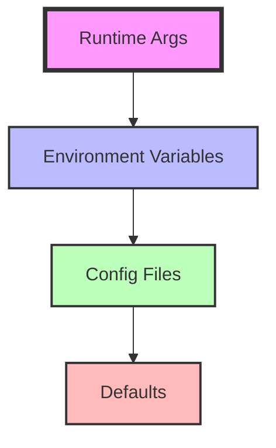

# Config

Configuration management for provide.foundation applications.

## Overview

provide.foundation offers flexible configuration through multiple sources, with a clear precedence order and sensible defaults. All user-facing configuration uses the **`PROVIDE_`** prefix for clear branding and namespace ownership.

## Configuration Sources

Configuration can be provided through (in order of precedence):

1. **Runtime Arguments** - Direct function/CLI parameters
2. **Environment Variables** - `PROVIDE_*` prefixed variables
3. **Configuration Files** - YAML, JSON, or TOML files
4. **Defaults** - Sensible defaults for all settings

## Quick Start

### Environment Variables

```bash
# Set logging level
export PROVIDE_LOG_LEVEL=DEBUG
export PROVIDE_LOG_FORMAT=pretty
export PROVIDE_NO_EMOJI=false

# Run your application
python app.py
```

### Configuration File

Create `config.yaml`:
```yaml
service_name: my-service
environment: production

logging:
  level: INFO
  console_formatter: json
  log_file: /var/log/service.log
  module_levels:
    database: DEBUG
    external_api: WARNING

app:
  port: 8080
  debug: false
  features:
    - auth
    - metrics
```

Load it with the configuration system:
```python
from provide.foundation.config import ConfigManager, FileConfigLoader
import asyncio

async def load_config():
    manager = ConfigManager()
    loader = FileConfigLoader("config.yaml")
    
    await manager.register("app", loader=loader)
    config = await manager.get("app")
    return config

config = asyncio.run(load_config())
```

### Runtime Configuration

```python
from provide.foundation import setup_logging, LoggingConfig

# Override at runtime
config = LoggingConfig(
    level="DEBUG",
    console_formatter="key_value",
    omit_timestamp=False
)
setup_logging(config)
```

## Configuration Hierarchy



## Core Settings

### Logging Configuration

| Setting | Environment Variable | Type | Default | Description |
|---------|---------------------|------|---------|-------------|
| Service Name | `PROVIDE_SERVICE_NAME` | string | None | Service identifier in logs |
| Log Level | `PROVIDE_LOG_LEVEL` | string | `DEBUG` | TRACE, DEBUG, INFO, WARNING, ERROR, CRITICAL |
| Console Format | `PROVIDE_LOG_CONSOLE_FORMATTER` | string | `key_value` | key_value, json |
| Log File | `PROVIDE_LOG_FILE` | path | None | Output file path |
| Omit Timestamp | `PROVIDE_LOG_OMIT_TIMESTAMP` | bool | `false` | Remove timestamps from console |
| Module Levels | `PROVIDE_LOG_MODULE_LEVELS` | string | "" | Per-module log levels (json) |
| Environment | `PROVIDE_ENV` | string | `dev` | Environment (dev/staging/prod) |
| Debug Mode | `PROVIDE_DEBUG` | bool | `false` | Enable debug mode |
| JSON Output | `PROVIDE_JSON_OUTPUT` | bool | `false` | Force JSON output |
| No Color | `PROVIDE_NO_COLOR` | bool | `false` | Disable colored output |

### Emoji Sets

| Setting | Environment Variable | Type | Default | Description |
|---------|---------------------|------|---------|-------------|
| Enable Layers | `PROVIDE_EMOJI_SETS` | bool | `true` | Enable emoji set processing |
| Enabled Layers | `PROVIDE_ENABLED_LAYERS` | list | all | Comma-separated layer names |
| Layer Timeout | `PROVIDE_LAYER_TIMEOUT_MS` | int | `10` | Processing timeout in ms |

### OpenTelemetry Integration

| Setting | Environment Variable | Type | Default | Description |
|---------|---------------------|------|---------|-------------|
| OTEL Endpoint | `PROVIDE_OTEL_ENDPOINT` | url | None | Collector endpoint |
| Service Name | `PROVIDE_OTEL_SERVICE_NAME` | string | app name | Service identifier |
| Export Traces | `PROVIDE_OTEL_TRACES` | bool | `true` | Enable trace export |
| Export Metrics | `PROVIDE_OTEL_METRICS` | bool | `true` | Enable metrics export |

### Application Settings

| Setting | Environment Variable | Type | Default | Description |
|---------|---------------------|------|---------|-------------|
| Config File | `PROVIDE_CONFIG_FILE` | path | None | Config file location |
| Profile | `PROVIDE_PROFILE` | string | `default` | Configuration profile |
| JSON Output | `PROVIDE_JSON_OUTPUT` | bool | `false` | Force JSON output |

## Configuration Profiles

Use profiles for environment-specific settings:

```yaml
# config.yaml
profiles:
  default:
    logging:
      level: INFO
      
  development:
    logging:
      level: DEBUG
      format: pretty
      emoji: true
    
  production:
    logging:
      level: WARNING
      format: json
      emoji: false
    otel:
      endpoint: https://otel-collector.prod:4317
```

Activate a profile:
```bash
export PROVIDE_PROFILE=production
# or
python app.py --profile production
```

## Type Coercion

Environment variables are automatically converted to the appropriate type:

```python
# These all work correctly
export PROVIDE_LOG_LEVEL=DEBUG                                    # string
export PROVIDE_LOG_OMIT_TIMESTAMP=true                          # bool (true/false, yes/no, 1/0)
export PROVIDE_DEBUG=1                                           # bool (1/0)
export PROVIDE_LOG_MODULE_LEVELS='{"database":"DEBUG","auth":"WARNING"}'  # JSON string
```

## Validation

Configuration is validated on load:

```python
from provide.foundation.config import BaseConfig, ConfigSchema, SchemaField
from provide.foundation.errors import ValidationError
from attrs import define

@define  
class AppConfig(BaseConfig):
    port: int = field(default=8080)
    debug: bool = field(default=False)
    
    def validate(self):
        if self.port < 1024 or self.port > 65535:
            raise ValidationError(f"Invalid port: {self.port}")

try:
    config = AppConfig.from_env()
    config.validate()
except ValidationError as e:
    print(f"Configuration error: {e}")
    # Provides helpful error messages
```

## Dynamic Reconfiguration

Some settings can be changed at runtime:

```python
from provide.foundation import logger
from provide.foundation.config import watch_config

# Watch for config file changes
@watch_config("config.yaml")
def on_config_change(new_config):
    logger.info("config_reloaded", 
                level=new_config.logging.level)
    logger.set_level(new_config.logging.level)

# Or manually reload
def reload_config():
    config = Config.from_file("config.yaml")
    apply_config(config)
```

## Internal/Debug Variables

For debugging, some `PROVIDE_` prefixed variables are available:

| Variable | Description | Use Case |
|----------|-------------|----------|
| `PROVIDE_SHOW_EMOJI_MATRIX` | Display emoji mapping table | Debug emoji mappings |
| `PROVIDE_DEBUG` | Enable internal debug logging | Troubleshooting |

⚠️ **Note**: These are for debugging only and may change between versions.

## Best Practices

1. **Use environment variables for secrets** - Never put secrets in config files
2. **Profile-based configuration** - Separate dev/staging/prod settings
3. **Validate early** - Check configuration at startup
4. **Document your settings** - Keep a `.env.example` file
5. **Use defaults wisely** - Production-safe defaults

## Examples

### Basic Application

```python
from provide.foundation import logger, setup_telemetry
from provide.foundation.config import BaseConfig, field
from attrs import define

@define
class AppConfig(BaseConfig):
    service_name: str = field(default="my-app")
    port: int = field(default=8080) 
    debug: bool = field(default=False)

# Load configuration from environment
config = AppConfig.from_env()

# Setup telemetry with service name
setup_telemetry(service_name=config.service_name, debug=config.debug)

# Use in application
logger.info("app_started", 
            service=config.service_name,
            port=config.port,
            debug=config.debug)
```

### CLI Application

```python
from provide.foundation.hub import Hub, register_command
from provide.foundation import setup_telemetry

@register_command("serve")
def serve_command(port: int = 8080, debug: bool = False):
    """Start the application server."""
    setup_telemetry(debug=debug)
    logger.info("Starting server", port=port, debug=debug)
    
if __name__ == "__main__":
    hub = Hub()
    cli = hub.create_cli(name="myapp", version="1.0.0")
    cli()
```

### Docker Configuration

```dockerfile
# Dockerfile
ENV PROVIDE_LOG_LEVEL=INFO
ENV PROVIDE_LOG_FORMAT=json
ENV PROVIDE_NO_COLOR=true
ENV PROVIDE_OTEL_ENDPOINT=http://otel-collector:4317
```

### Kubernetes ConfigMap

```yaml
apiVersion: v1
kind: ConfigMap
metadata:
  name: app-config
data:
  PROVIDE_LOG_LEVEL: "INFO"
  PROVIDE_LOG_FORMAT: "json"
  PROVIDE_EMOJI_SETS: "true"
  PROVIDE_OTEL_SERVICE_NAME: "my-service"
```

## Next Steps

- [Environment Variables](environment.md) - Detailed env var reference
- [Config Files](files.md) - File format specifications
- [Runtime Config](runtime.md) - Dynamic configuration
- [Best Practices](best-practices.md) - Production recommendations
