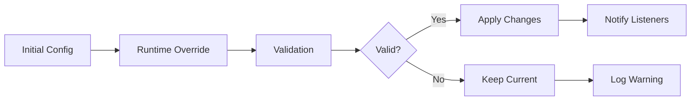

# Runtime Configuration

Dynamically update provide.foundation configuration during application execution.

## Overview

Runtime configuration allows you to modify settings without restarting your application. This is essential for:

- 🔄 **Hot reloading** - Update settings without downtime
- 🎛️ **Feature toggles** - Enable/disable features dynamically
- 📊 **Performance tuning** - Adjust buffers and timeouts on the fly
- 🐛 **Debug mode** - Temporarily increase logging verbosity
- 🌍 **Multi-tenant** - Per-request configuration overrides

## Configuration Flow



## Basic Runtime Updates

### Update Log Level

```python
from provide.foundation import logger
from provide.foundation.config import Config

# Initial configuration
config = Config.from_env()
logger.info("app_started", level=config.logging.level)

# Runtime update
def increase_verbosity():
    """Temporarily increase log verbosity."""
    logger.set_level("DEBUG")
    logger.debug("debug_mode_enabled")
    
    # Do debugging work...
    
    # Restore original
    logger.set_level(config.logging.level)
```

### Toggle Features

```python
from provide.foundation.config import RuntimeConfig

class AppConfig(RuntimeConfig):
    """Application configuration with runtime updates."""
    
    def __init__(self):
        super().__init__()
        self.features = {
            "new_algorithm": False,
            "beta_ui": False,
            "enhanced_monitoring": True
        }
    
    def enable_feature(self, name: str):
        """Enable a feature at runtime."""
        if name in self.features:
            old_value = self.features[name]
            self.features[name] = True
            self.notify_change("feature", name, old_value, True)
            logger.info("feature_enabled", feature=name)
    
    def disable_feature(self, name: str):
        """Disable a feature at runtime."""
        if name in self.features:
            old_value = self.features[name]
            self.features[name] = False
            self.notify_change("feature", name, old_value, False)
            logger.info("feature_disabled", feature=name)

# Usage
config = AppConfig()

if config.features["new_algorithm"]:
    process_with_new_algorithm()
else:
    process_with_old_algorithm()
```

## Configuration Watchers

### File Watching

Monitor configuration files for changes:

```python
from provide.foundation.config import watch_config
from provide.foundation import logger
import os

@watch_config("config.yaml", interval=5)
def on_config_change(old_config, new_config):
    """Handle configuration file changes."""
    
    # Log what changed
    changes = []
    for key in new_config:
        if getattr(old_config, key, None) != getattr(new_config, key):
            changes.append(key)
    
    logger.info("config_reloaded", 
                changed_keys=changes,
                source="file_watch")
    
    # Apply changes
    if old_config.logging.level != new_config.logging.level:
        logger.set_level(new_config.logging.level)
    
    if old_config.buffer_size != new_config.buffer_size:
        resize_buffers(new_config.buffer_size)
    
    return new_config

# Manual file watching
from watchdog.observers import Observer
from watchdog.events import FileSystemEventHandler

class ConfigFileHandler(FileSystemEventHandler):
    def __init__(self, config_path, callback):
        self.config_path = config_path
        self.callback = callback
        self.last_modified = os.path.getmtime(config_path)
    
    def on_modified(self, event):
        if event.src_path == self.config_path:
            current_modified = os.path.getmtime(self.config_path)
            if current_modified != self.last_modified:
                self.last_modified = current_modified
                self.callback()

def setup_config_watching(config_path="config.yaml"):
    def reload_config():
        try:
            new_config = Config.from_file(config_path)
            apply_config(new_config)
        except Exception as e:
            logger.error("config_reload_failed", error=str(e))
    
    handler = ConfigFileHandler(config_path, reload_config)
    observer = Observer()
    observer.schedule(handler, path=os.path.dirname(config_path))
    observer.start()
    return observer
```

### Environment Variable Watching

```python
import os
import threading
import time
from provide.foundation.config import Config

class EnvWatcher:
    """Watch for environment variable changes."""
    
    def __init__(self, prefix="PROVIDE_", interval=10):
        self.prefix = prefix
        self.interval = interval
        self.running = False
        self.thread = None
        self.last_env = self._capture_env()
    
    def _capture_env(self):
        """Capture current environment variables."""
        return {k: v for k, v in os.environ.items() 
                if k.startswith(self.prefix)}
    
    def start(self, callback):
        """Start watching for changes."""
        self.running = True
        
        def watch():
            while self.running:
                current_env = self._capture_env()
                if current_env != self.last_env:
                    changes = self._find_changes(self.last_env, current_env)
                    self.last_env = current_env
                    callback(changes)
                time.sleep(self.interval)
        
        self.thread = threading.Thread(target=watch, daemon=True)
        self.thread.start()
    
    def _find_changes(self, old, new):
        """Find what changed between environments."""
        changes = {
            "added": {k: v for k, v in new.items() if k not in old},
            "removed": {k: old[k] for k in old if k not in new},
            "modified": {k: (old[k], new[k]) for k in old 
                        if k in new and old[k] != new[k]}
        }
        return changes
    
    def stop(self):
        """Stop watching."""
        self.running = False
        if self.thread:
            self.thread.join()

# Usage
watcher = EnvWatcher()

def handle_env_changes(changes):
    logger.info("env_changed", changes=changes)
    
    # Reload configuration
    new_config = Config.from_env()
    apply_config(new_config)

watcher.start(handle_env_changes)
```

## Remote Configuration

### Configuration Server

```python
import asyncio
import aiohttp
from provide.foundation.config import Config
from provide.foundation import logger

class RemoteConfig:
    """Remote configuration management."""
    
    def __init__(self, endpoint: str, api_key: str):
        self.endpoint = endpoint
        self.api_key = api_key
        self.session = None
        self.current_config = None
        self.polling_task = None
    
    async def connect(self):
        """Connect to configuration server."""
        self.session = aiohttp.ClientSession(
            headers={"Authorization": f"Bearer {self.api_key}"}
        )
        
        # Fetch initial configuration
        self.current_config = await self.fetch_config()
        logger.info("remote_config_connected", 
                   endpoint=self.endpoint)
    
    async def fetch_config(self) -> Config:
        """Fetch configuration from server."""
        async with self.session.get(f"{self.endpoint}/config") as resp:
            if resp.status == 200:
                data = await resp.json()
                return Config(**data)
            else:
                raise Exception(f"Failed to fetch config: {resp.status}")
    
    async def start_polling(self, interval: int = 30):
        """Poll for configuration changes."""
        async def poll():
            while True:
                try:
                    new_config = await self.fetch_config()
                    if new_config != self.current_config:
                        await self.handle_config_change(new_config)
                    await asyncio.sleep(interval)
                except Exception as e:
                    logger.error("config_poll_failed", error=str(e))
                    await asyncio.sleep(interval * 2)  # Back off
        
        self.polling_task = asyncio.create_task(poll())
    
    async def handle_config_change(self, new_config: Config):
        """Handle configuration changes."""
        old_config = self.current_config
        self.current_config = new_config
        
        logger.info("remote_config_updated",
                   version=new_config.version)
        
        # Apply changes
        await apply_config_async(new_config)
        
        # Notify listeners
        for listener in self.listeners:
            await listener(old_config, new_config)
    
    async def push_config(self, config: Config):
        """Push configuration to server."""
        async with self.session.put(
            f"{self.endpoint}/config",
            json=config.to_dict()
        ) as resp:
            if resp.status != 200:
                raise Exception(f"Failed to push config: {resp.status}")
    
    async def close(self):
        """Close connection."""
        if self.polling_task:
            self.polling_task.cancel()
        if self.session:
            await self.session.close()

# Usage
async def main():
    remote = RemoteConfig(
        endpoint="https://config.example.com",
        api_key=os.getenv("CONFIG_API_KEY")
    )
    
    await remote.connect()
    await remote.start_polling(interval=30)
    
    # Your application logic
    while True:
        if remote.current_config.feature_flags.get("new_feature"):
            await process_with_new_feature()
        else:
            await process_normally()
        
        await asyncio.sleep(1)
```

### WebSocket Configuration

```python
import websockets
import json
from provide.foundation.config import Config

class WebSocketConfig:
    """Real-time configuration via WebSocket."""
    
    def __init__(self, uri: str):
        self.uri = uri
        self.websocket = None
        self.config = Config.from_env()  # Start with env config
    
    async def connect(self):
        """Connect to WebSocket configuration server."""
        self.websocket = await websockets.connect(self.uri)
        logger.info("websocket_config_connected", uri=self.uri)
        
        # Send initial registration
        await self.websocket.send(json.dumps({
            "action": "register",
            "service": os.getenv("PROVIDE_APP_NAME", "unknown"),
            "version": os.getenv("PROVIDE_APP_VERSION", "0.0.0")
        }))
    
    async def listen(self):
        """Listen for configuration updates."""
        async for message in self.websocket:
            try:
                data = json.loads(message)
                await self.handle_message(data)
            except Exception as e:
                logger.error("websocket_message_error", 
                           error=str(e), message=message)
    
    async def handle_message(self, data: dict):
        """Handle WebSocket messages."""
        action = data.get("action")
        
        if action == "update_config":
            new_config = Config(**data["config"])
            await self.apply_config(new_config)
            
        elif action == "set_feature":
            feature = data["feature"]
            enabled = data["enabled"]
            self.config.features[feature] = enabled
            logger.info("feature_toggled", 
                       feature=feature, enabled=enabled)
            
        elif action == "set_log_level":
            level = data["level"]
            logger.set_level(level)
            logger.info("log_level_changed", level=level)
            
        elif action == "reload":
            # Full configuration reload
            self.config = Config.from_env().merge(Config(**data.get("overrides", {})))
            await self.apply_config(self.config)
    
    async def apply_config(self, config: Config):
        """Apply configuration changes."""
        old_config = self.config
        self.config = config
        
        # Apply logging changes
        if old_config.logging.level != config.logging.level:
            logger.set_level(config.logging.level)
        
        # Apply performance changes
        if old_config.buffer_size != config.buffer_size:
            await resize_buffers_async(config.buffer_size)
        
        logger.info("config_applied", 
                   source="websocket",
                   version=config.version)

# Usage
async def websocket_config_client():
    config = WebSocketConfig("wss://config.example.com/ws")
    
    while True:
        try:
            await config.connect()
            await config.listen()
        except websockets.exceptions.ConnectionClosed:
            logger.warning("websocket_disconnected", 
                         action="reconnecting")
            await asyncio.sleep(5)  # Reconnect delay
```

## Thread-Safe Updates

### Configuration Locking

```python
import threading
from contextlib import contextmanager
from provide.foundation.config import Config

class ThreadSafeConfig:
    """Thread-safe configuration management."""
    
    def __init__(self, initial_config: Config):
        self._config = initial_config
        self._lock = threading.RLock()
        self._version = 0
        self._listeners = []
    
    @property
    def config(self) -> Config:
        """Get current configuration."""
        with self._lock:
            return self._config
    
    def update(self, new_config: Config):
        """Update configuration atomically."""
        with self._lock:
            old_config = self._config
            self._config = new_config
            self._version += 1
            
            # Notify listeners outside lock
            listeners = list(self._listeners)
        
        # Notify without holding lock
        for listener in listeners:
            try:
                listener(old_config, new_config)
            except Exception as e:
                logger.error("config_listener_error", 
                           error=str(e), listener=listener)
    
    @contextmanager
    def atomic_update(self):
        """Context manager for atomic updates."""
        with self._lock:
            # Create a copy for modification
            temp_config = Config(**self._config.to_dict())
            yield temp_config
            # Apply the modified config
            self.update(temp_config)
    
    def add_listener(self, callback):
        """Add configuration change listener."""
        with self._lock:
            self._listeners.append(callback)
    
    def remove_listener(self, callback):
        """Remove configuration change listener."""
        with self._lock:
            self._listeners.remove(callback)
    
    def get_version(self) -> int:
        """Get configuration version."""
        with self._lock:
            return self._version

# Usage
safe_config = ThreadSafeConfig(Config.from_env())

# Update configuration
def update_worker():
    with safe_config.atomic_update() as config:
        config.logging.level = "DEBUG"
        config.buffer_size = 10000
    # Changes applied atomically here

# Read configuration
def read_worker():
    current = safe_config.config
    logger.info("config_read", 
               version=safe_config.get_version(),
               level=current.logging.level)
```

## Configuration Validation

### Runtime Validation

```python
from provide.foundation.config import Config, ValidationError
from typing import Any

class ValidatedRuntimeConfig:
    """Configuration with runtime validation."""
    
    def __init__(self, config: Config):
        self.config = config
        self.validators = []
        self.register_default_validators()
    
    def register_default_validators(self):
        """Register default validation rules."""
        
        @self.validator("logging.level")
        def validate_log_level(value: str) -> bool:
            valid = ["TRACE", "DEBUG", "INFO", "WARNING", "ERROR"]
            return value.upper() in valid
        
        @self.validator("buffer_size")
        def validate_buffer_size(value: int) -> bool:
            return 100 <= value <= 100000
        
        @self.validator("otel.sample_rate")
        def validate_sample_rate(value: float) -> bool:
            return 0.0 <= value <= 1.0
    
    def validator(self, field_path: str):
        """Decorator to register a validator."""
        def decorator(func):
            self.validators.append((field_path, func))
            return func
        return decorator
    
    def validate_change(self, field_path: str, new_value: Any) -> bool:
        """Validate a configuration change."""
        for path, validator in self.validators:
            if path == field_path:
                try:
                    if not validator(new_value):
                        logger.warning("config_validation_failed",
                                     field=field_path,
                                     value=new_value)
                        return False
                except Exception as e:
                    logger.error("config_validator_error",
                               field=field_path,
                               error=str(e))
                    return False
        return True
    
    def set_field(self, field_path: str, value: Any):
        """Set a configuration field with validation."""
        if not self.validate_change(field_path, value):
            raise ValidationError(f"Invalid value for {field_path}: {value}")
        
        # Navigate to the field
        parts = field_path.split(".")
        obj = self.config
        for part in parts[:-1]:
            obj = getattr(obj, part)
        
        # Set the value
        old_value = getattr(obj, parts[-1])
        setattr(obj, parts[-1], value)
        
        logger.info("config_field_updated",
                   field=field_path,
                   old_value=old_value,
                   new_value=value)
```

## Performance Considerations

### Lazy Configuration

```python
from functools import lru_cache
from provide.foundation.config import Config

class LazyConfig:
    """Lazy-loading configuration."""
    
    def __init__(self):
        self._config = None
        self._loaded = False
    
    @property
    def config(self) -> Config:
        """Load configuration on first access."""
        if not self._loaded:
            self._config = self._load_config()
            self._loaded = True
        return self._config
    
    @lru_cache(maxsize=1)
    def _load_config(self) -> Config:
        """Load configuration with caching."""
        logger.debug("loading_config")
        
        # Try multiple sources
        config = Config()
        
        # Load from file if exists
        if os.path.exists("config.yaml"):
            config = config.merge(Config.from_file("config.yaml"))
        
        # Override with environment
        config = config.merge_env()
        
        # Apply runtime overrides
        if os.path.exists(".runtime-config.json"):
            import json
            with open(".runtime-config.json") as f:
                overrides = json.load(f)
                config = config.merge(Config(**overrides))
        
        return config
    
    def invalidate(self):
        """Invalidate cached configuration."""
        self._loaded = False
        self._load_config.cache_clear()
        logger.debug("config_cache_invalidated")

# Global lazy config
lazy_config = LazyConfig()

# Access triggers load
if lazy_config.config.debug_mode:
    enable_debug_features()
```

### Configuration Snapshots

```python
import pickle
import hashlib
from datetime import datetime

class ConfigSnapshot:
    """Configuration snapshot management."""
    
    def __init__(self, config: Config):
        self.config = config
        self.timestamp = datetime.utcnow()
        self.hash = self._compute_hash()
    
    def _compute_hash(self) -> str:
        """Compute configuration hash."""
        data = pickle.dumps(self.config.to_dict(), protocol=pickle.HIGHEST_PROTOCOL)
        return hashlib.sha256(data).hexdigest()
    
    def has_changed(self, other: 'ConfigSnapshot') -> bool:
        """Check if configuration has changed."""
        return self.hash != other.hash
    
    def get_differences(self, other: 'ConfigSnapshot') -> dict:
        """Get differences between snapshots."""
        def diff_dict(d1, d2, path=""):
            differences = {}
            
            for key in d1:
                current_path = f"{path}.{key}" if path else key
                
                if key not in d2:
                    differences[current_path] = {"removed": d1[key]}
                elif d1[key] != d2[key]:
                    if isinstance(d1[key], dict) and isinstance(d2[key], dict):
                        nested = diff_dict(d1[key], d2[key], current_path)
                        differences.update(nested)
                    else:
                        differences[current_path] = {
                            "old": d1[key],
                            "new": d2[key]
                        }
            
            for key in d2:
                if key not in d1:
                    current_path = f"{path}.{key}" if path else key
                    differences[current_path] = {"added": d2[key]}
            
            return differences
        
        return diff_dict(self.config.to_dict(), other.config.to_dict())

# Usage
class ConfigHistory:
    """Track configuration changes over time."""
    
    def __init__(self, max_snapshots: int = 10):
        self.snapshots = []
        self.max_snapshots = max_snapshots
    
    def add_snapshot(self, config: Config):
        """Add a configuration snapshot."""
        snapshot = ConfigSnapshot(config)
        
        # Check if changed from last
        if self.snapshots and not snapshot.has_changed(self.snapshots[-1]):
            return  # No change
        
        self.snapshots.append(snapshot)
        
        # Limit history size
        if len(self.snapshots) > self.max_snapshots:
            self.snapshots.pop(0)
        
        logger.info("config_snapshot_added",
                   hash=snapshot.hash[:8],
                   total_snapshots=len(self.snapshots))
    
    def get_changes(self, from_index: int = -2, to_index: int = -1) -> dict:
        """Get changes between snapshots."""
        if len(self.snapshots) < 2:
            return {}
        
        from_snap = self.snapshots[from_index]
        to_snap = self.snapshots[to_index]
        
        return from_snap.get_differences(to_snap)
```

## Best Practices

### 1. Graceful Degradation

```python
def apply_runtime_config(new_config: Config) -> bool:
    """Apply configuration with fallback."""
    
    try:
        # Validate first
        new_config.validate()
        
        # Create backup
        old_config = get_current_config()
        
        # Apply changes
        set_current_config(new_config)
        
        # Test critical functions
        if not test_critical_functions():
            # Rollback
            set_current_config(old_config)
            logger.error("config_rollback", 
                        reason="critical_function_failed")
            return False
        
        logger.info("config_applied_successfully")
        return True
        
    except Exception as e:
        logger.error("config_apply_failed", error=str(e))
        return False
```

### 2. Configuration Versioning

```python
class VersionedConfig(Config):
    """Configuration with version tracking."""
    
    def __init__(self, **kwargs):
        super().__init__(**kwargs)
        self.version = kwargs.get("version", "1.0.0")
        self.last_updated = datetime.utcnow()
    
    def is_compatible(self, required_version: str) -> bool:
        """Check version compatibility."""
        from packaging import version
        return version.parse(self.version) >= version.parse(required_version)
    
    def update_version(self):
        """Update version after changes."""
        # Increment patch version
        parts = self.version.split(".")
        parts[-1] = str(int(parts[-1]) + 1)
        self.version = ".".join(parts)
        self.last_updated = datetime.utcnow()
```

### 3. Configuration Contracts

```python
from abc import ABC, abstractmethod

class ConfigContract(ABC):
    """Contract for configuration consumers."""
    
    @abstractmethod
    def can_handle_config(self, config: Config) -> bool:
        """Check if component can handle configuration."""
        pass
    
    @abstractmethod
    def apply_config(self, config: Config):
        """Apply configuration to component."""
        pass
    
    @abstractmethod
    def validate_config(self, config: Config) -> list[str]:
        """Validate configuration, return errors."""
        pass

class LoggerConfigContract(ConfigContract):
    """Logger configuration contract."""
    
    def can_handle_config(self, config: Config) -> bool:
        return hasattr(config, "logging")
    
    def apply_config(self, config: Config):
        if config.logging.level:
            logger.set_level(config.logging.level)
        if config.logging.format:
            logger.set_format(config.logging.format)
    
    def validate_config(self, config: Config) -> list[str]:
        errors = []
        valid_levels = ["DEBUG", "INFO", "WARNING", "ERROR"]
        if config.logging.level not in valid_levels:
            errors.append(f"Invalid log level: {config.logging.level}")
        return errors
```

## Monitoring & Metrics

```python
from provide.foundation.metrics import counter, gauge, histogram

# Configuration metrics
config_updates = counter("config_updates_total")
config_failures = counter("config_failures_total")
config_version = gauge("config_version")
config_reload_duration = histogram("config_reload_duration_seconds")

def monitored_config_update(new_config: Config):
    """Update configuration with metrics."""
    
    start_time = time.time()
    
    try:
        apply_config(new_config)
        config_updates.inc(labels={"status": "success"})
        config_version.set(hash(str(new_config))[:8])
        
    except Exception as e:
        config_failures.inc(labels={"reason": type(e).__name__})
        raise
        
    finally:
        duration = time.time() - start_time
        config_reload_duration.observe(duration)
        
        logger.info("config_update_metrics",
                   duration_seconds=duration,
                   success=not bool(e))
```

## Next Steps

- 🌍 [Environment Variables](environment.md) - Environment-based configuration
- 📁 [Configuration Files](files.md) - File-based configuration
- 📚 [Best Practices](best-practices.md) - Production recommendations
- 🏠 [Back to Config Guide](index.md)