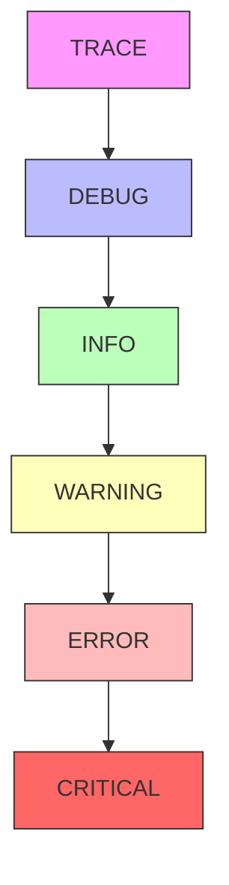

# Basic Logging

Fundamental logging patterns and usage with provide.foundation.

## Overview

provide.foundation offers structured logging that is:

- 📊 **Structured** - Key-value pairs for analysis
- 🎨 **Beautiful** - Emoji-enhanced visual parsing
- ⚡ **Fast** - >14,000 messages/second
- 🔒 **Thread-safe** - Safe for concurrent use
- 🔄 **Async-compatible** - Full async/await support

## Quick Start

```python
from provide.foundation import logger

# Simple logging
logger.info("Application started")
logger.debug("Processing request", request_id="abc123")
logger.warning("High memory usage", usage_mb=1024)
logger.error("Connection failed", host="api.example.com", port=443)
```

## Log Levels

### Available Levels

```python
from provide.foundation import logger

# In order of severity (least to most)
logger.trace("Very detailed diagnostic info")     # TRACE
logger.debug("Diagnostic information")            # DEBUG
logger.info("General informational message")      # INFO
logger.warning("Warning, but operation continues") # WARNING
logger.error("Error occurred, operation failed")   # ERROR
logger.critical("Critical failure, may crash")     # CRITICAL
```

### Setting Log Level

```python
from provide.foundation import logger
import os

# Via environment variable (preferred)
os.environ["PROVIDE_LOG_LEVEL"] = "DEBUG"

# Or programmatically
logger.set_level("DEBUG")

# Check current level
current = logger.get_level()
print(f"Current level: {current}")
```

### Level Hierarchy



## Structured Data

### Key-Value Pairs

```python
# Add context with keyword arguments
logger.info("user_login",
    user_id="usr_123",
    email="user@example.com",
    ip_address="192.168.1.1",
    timestamp=1234567890
)

# Output (pretty format):
# ✅ user_login user_id=usr_123 email=user@example.com ip=192.168.1.1 timestamp=1234567890

# Output (JSON format):
# {"event": "user_login", "user_id": "usr_123", "email": "user@example.com", ...}
```

### Nested Data

```python
# Log complex objects
logger.info("order_processed",
    order_id="ord_456",
    customer={
        "id": "cust_789",
        "name": "John Doe",
        "tier": "premium"
    },
    items=[
        {"sku": "ABC123", "quantity": 2, "price": 29.99},
        {"sku": "XYZ789", "quantity": 1, "price": 49.99}
    ],
    total=109.97
)
```

### Data Types

```python
# All Python types are supported
logger.info("metrics",
    # Basic types
    string="text",
    integer=42,
    floating=3.14,
    boolean=True,
    none_value=None,
    
    # Collections
    list_data=[1, 2, 3],
    tuple_data=(4, 5, 6),
    set_data={7, 8, 9},
    dict_data={"key": "value"},
    
    # Special types
    path=Path("/usr/local/bin"),
    uuid=uuid.uuid4(),
    datetime=datetime.now(),
    timedelta=timedelta(hours=2),
    exception=ValueError("Example error")
)
```

## Message Formatting

### Event Names

Use descriptive event names following the Domain-Action-Status pattern:

```python
# Good event names
logger.info("database_connection_established")
logger.info("user_registration_completed")
logger.error("payment_processing_failed")
logger.warning("cache_expiration_approaching")

# Avoid generic names
logger.info("success")  # Too vague
logger.error("error")   # Redundant with level
```

### String Interpolation

```python
# ✅ Good: Structured data
logger.info("file_processed",
    filename="data.csv",
    size_mb=10.5,
    duration_ms=150
)

# ❌ Avoid: String formatting
logger.info(f"Processed data.csv (10.5 MB) in 150ms")
# Less searchable, harder to analyze
```

### Multi-line Messages

```python
# Use description field for longer text
logger.info("deployment_complete",
    service="api-gateway",
    version="2.1.0",
    description="""
    Successfully deployed API Gateway v2.1.0
    - Updated 3 instances
    - Zero downtime migration
    - All health checks passing
    """
)
```

## Context Binding

### Temporary Context

```python
from provide.foundation import logger

# Add context for a block
with logger.bind(request_id="req_123", user_id="usr_456"):
    logger.info("request_started")
    # Both request_id and user_id are included
    
    process_request()
    
    logger.info("request_completed")
    # Still includes the context

# Context is removed here
logger.info("other_operation")  # No request_id or user_id
```

### Permanent Context

```python
# Create a logger with permanent context
request_logger = logger.bind(
    service="payment-api",
    environment="production",
    region="us-west-2"
)

# All logs include the bound context
request_logger.info("service_started")
request_logger.debug("processing_payment", amount=99.99)
```

### Nested Context

```python
# Context can be nested
with logger.bind(request_id="req_001"):
    logger.info("request_received")
    
    with logger.bind(user_id="usr_123"):
        logger.info("user_authenticated")
        # Includes both request_id and user_id
        
        with logger.bind(transaction_id="txn_456"):
            logger.info("transaction_started")
            # Includes all three IDs
```

## Output Formats

### Pretty Format (Development)

```python
os.environ["PROVIDE_LOG_FORMAT"] = "pretty"

logger.info("server_started", port=8080, workers=4)
# Output: ✅ server_started port=8080 workers=4

logger.error("database_error", error="Connection refused")
# Output: 🔥 database_error error='Connection refused'
```

### JSON Format (Production)

```python
os.environ["PROVIDE_LOG_FORMAT"] = "json"

logger.info("server_started", port=8080, workers=4)
# Output: {"event": "server_started", "level": "info", "port": 8080, "workers": 4, "timestamp": "2024-01-20T10:30:00Z"}
```

### Compact Format (CI/CD)

```python
os.environ["PROVIDE_LOG_FORMAT"] = "compact"

logger.info("test_passed", test="auth", duration_ms=45)
# Output: [INFO] test_passed test=auth duration_ms=45
```

### Plain Format (Debugging)

```python
os.environ["PROVIDE_LOG_FORMAT"] = "plain"

logger.info("debug_info", step=1, status="ok")
# Output: debug_info step=1 status=ok
```

## Emoji System

### Automatic Emoji

Emojis are automatically added based on log level and content:

```python
# Level-based emoji
logger.info("Operation successful")      # ℹ️
logger.warning("Low disk space")         # ⚠️
logger.error("Connection failed")        # ❌
logger.debug("Debug information")        # 🐛

# Semantic layer emoji
logger.info("http_request", method="GET", status=200)  # 📥 ✅
logger.info("database_query", operation="SELECT")      # 🗄️
logger.info("llm_completion", provider="openai")       # 🤖
```

### Disable Emoji

```python
# Via environment variable
os.environ["PROVIDE_NO_EMOJI"] = "true"

# Or in configuration
from provide.foundation.config import Config

config = Config(logging={"no_emoji": True})
```

## Exception Logging

### Basic Exception Logging

```python
try:
    risky_operation()
except Exception as e:
    logger.error("operation_failed", 
                error=str(e),
                error_type=type(e).__name__)
```

### With Traceback

```python
import traceback

try:
    risky_operation()
except Exception as e:
    logger.error("operation_failed",
                error=str(e),
                traceback=traceback.format_exc())
```

### Exception Context Manager

```python
from provide.foundation.errors import log_exceptions

with log_exceptions("risky_block"):
    # Any exception is automatically logged
    perform_risky_operation()
    another_risky_operation()
# Exceptions are logged and re-raised
```

## Performance Tips

### 1. Use Appropriate Levels

```python
# Only log at appropriate levels
logger.trace("Every iteration detail")  # Only in deep debugging
logger.debug("Useful diagnostic info")   # Development/debugging
logger.info("Important events")          # Normal operations
logger.warning("Concerning situations")  # Potential issues
logger.error("Failures and errors")      # Actual problems
```

### 2. Lazy Evaluation

```python
# Use callable for expensive computations
logger.debug("expensive_data",
    data=lambda: expensive_computation()  # Only called if DEBUG is enabled
)

# Or check level explicitly
if logger.is_enabled_for("DEBUG"):
    result = expensive_computation()
    logger.debug("computed_result", result=result)
```

### 3. Batch Operations

```python
# For high-volume logging
from provide.foundation import logger

# Buffer multiple log entries
with logger.batch():
    for item in large_collection:
        logger.info("item_processed", item_id=item.id)
# All logs are flushed together
```

### 4. Sampling

```python
import random

# Sample logs for high-frequency events
if random.random() < 0.01:  # 1% sampling
    logger.debug("high_frequency_event", data=event_data)
```

## Common Patterns

### Request Logging

```python
def handle_request(request):
    """Log request lifecycle."""
    
    # Start of request
    logger.info("request_received",
                method=request.method,
                path=request.path,
                remote_ip=request.remote_ip)
    
    start_time = time.time()
    
    try:
        response = process_request(request)
        
        # Success
        logger.info("request_completed",
                    method=request.method,
                    path=request.path,
                    status=response.status_code,
                    duration_ms=(time.time() - start_time) * 1000)
        
        return response
        
    except Exception as e:
        # Failure
        logger.error("request_failed",
                    method=request.method,
                    path=request.path,
                    error=str(e),
                    duration_ms=(time.time() - start_time) * 1000)
        raise
```

### Operation Timing

```python
from contextlib import contextmanager
import time

@contextmanager
def timed_operation(name: str):
    """Log operation duration."""
    start = time.time()
    logger.info(f"{name}_started")
    
    try:
        yield
        duration_ms = (time.time() - start) * 1000
        logger.info(f"{name}_completed", duration_ms=duration_ms)
        
    except Exception as e:
        duration_ms = (time.time() - start) * 1000
        logger.error(f"{name}_failed", 
                    error=str(e),
                    duration_ms=duration_ms)
        raise

# Usage
with timed_operation("database_migration"):
    run_migrations()
```

### Audit Logging

```python
def audit_log(action: str, entity: str, entity_id: str, **details):
    """Create audit log entry."""
    
    logger.info("audit_event",
                action=action,
                entity=entity,
                entity_id=entity_id,
                user_id=get_current_user_id(),
                timestamp=datetime.utcnow().isoformat(),
                ip_address=get_client_ip(),
                **details)

# Usage
audit_log("update", "user", "usr_123",
         fields_changed=["email", "phone"],
         old_values={"email": "old@example.com"},
         new_values={"email": "new@example.com"})
```

## Testing with Logs

### Capture Logs in Tests

```python
import pytest
from provide.foundation import logger
from provide.foundation.testing import capture_logs

def test_operation_logs_correctly():
    with capture_logs() as logs:
        my_function()
    
    # Check logs were created
    assert len(logs) > 0
    
    # Check specific log
    assert any(
        log["event"] == "operation_completed" 
        for log in logs
    )
    
    # Check log data
    completed_log = next(
        log for log in logs 
        if log["event"] == "operation_completed"
    )
    assert completed_log["status"] == "success"
```

### Mock Logger

```python
from unittest.mock import Mock, patch

def test_with_mock_logger():
    mock_logger = Mock()
    
    with patch("provide.foundation.logger", mock_logger):
        my_function()
    
    # Verify logging calls
    mock_logger.info.assert_called_with(
        "expected_event",
        expected_key="expected_value"
    )
```

## Best Practices

### 1. Use Structured Data

```python
# ✅ Good
logger.info("user_action",
            action="login",
            user_id="usr_123",
            success=True)

# ❌ Bad
logger.info(f"User usr_123 logged in successfully")
```

### 2. Consistent Event Names

```python
# Use consistent naming patterns
logger.info("payment_initiated")
logger.info("payment_processed")
logger.info("payment_completed")
logger.error("payment_failed")
```

### 3. Include Context

```python
# Always include relevant context
logger.error("api_request_failed",
            endpoint="/api/users",
            method="GET",
            status_code=500,
            response_time_ms=1500,
            error_message="Internal server error")
```

### 4. Don't Log Sensitive Data

```python
# ❌ Bad: Logging passwords or tokens
logger.info("user_login", 
           username="john",
           password="secret123")  # Never log passwords!

# ✅ Good: Log safe identifiers
logger.info("user_login",
           username="john",
           user_id="usr_123",
           auth_method="password")
```

### 5. Use Appropriate Levels

```python
# Choose the right level for the situation
logger.trace("Entering function with args: {}")     # Very detailed
logger.debug("Intermediate calculation result: {}") # Debugging
logger.info("Order processed successfully")         # Business event
logger.warning("Retry attempt 3 of 5")             # Concerning
logger.error("Failed to connect to database")       # Error
logger.critical("System out of memory")            # Critical
```

## Next Steps

- 📚 [Advanced Logging](advanced.md) - Advanced patterns and techniques
- 🔄 [Async Logging](async.md) - Asynchronous logging patterns
- 🎯 [Context Management](context.md) - Managing log context
- ⚠️ [Exception Handling](exceptions.md) - Logging exceptions effectively
- ⚡ [Performance Tuning](performance.md) - Optimizing log performance
- 🏠 [Back to Logging Guide](index.md)