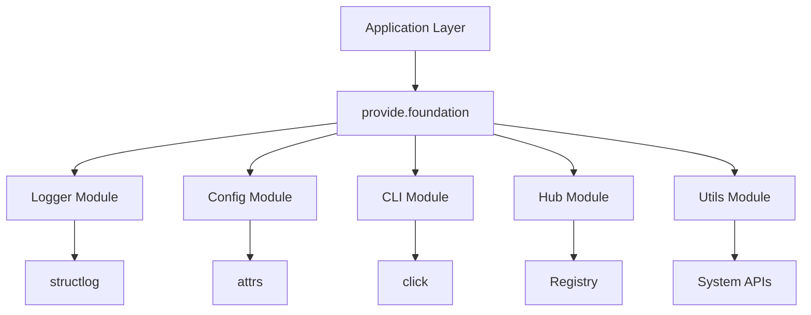
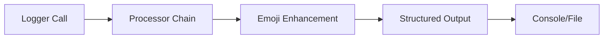
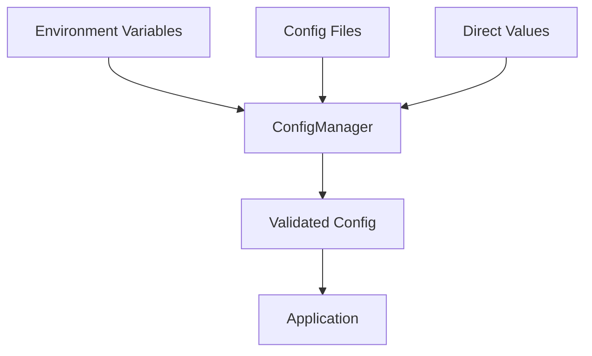

# Architecture Overview

## System Design

provide.foundation is designed as a **layered foundation library** that provides common infrastructure components for Python applications.



## Core Modules

### Logger Module
**Purpose**: Structured, performant logging with visual enhancement

- **Base**: Core logger implementation and global instance
- **Config**: TelemetryConfig and LoggingConfig management
- **Processors**: Log processing pipeline with emoji enhancement
- **Emoji System**: Domain-specific visual log parsing

### Configuration Module
**Purpose**: Multi-source, type-safe configuration management

- **Base**: Abstract configuration classes
- **Loader**: File and environment variable loading
- **Manager**: Centralized configuration orchestration
- **Schema**: Type validation and constraint checking

### CLI Module
**Purpose**: Decorator-based command-line interface framework

- **Decorators**: Command registration and configuration
- **Utils**: CLI utility functions and helpers
- **Testing**: CLI testing utilities and fixtures

### Hub Module
**Purpose**: Component registry and lifecycle management

- **Manager**: Component lifecycle orchestration
- **Registry**: Service registration and discovery
- **Components**: Base component classes
- **Commands**: Command registration within hub

### Utilities Module
**Purpose**: Cross-platform system utilities

- **Platform**: OS and architecture detection
- **Process**: Safe subprocess execution
- **File**: Atomic file operations
- **Console**: Standardized I/O operations
- **Streams**: Stream processing utilities

## Design Principles

### 1. Lazy Initialization
Components initialize only when needed to avoid import-time side effects.

```python
# Logger starts uninitialized
from provide.foundation import logger

# Initializes on first use
logger.info("first_message")  # Triggers setup
```

### 2. Async-First Design
All APIs support both sync and async usage patterns.

```python
# Sync usage
config = TelemetryConfig.from_env()

# Async usage  
config = await TelemetryConfig.from_env_async()
```

### 3. Type Safety
Extensive use of modern Python type hints and runtime validation.

```python
@attrs.frozen
class LoggingConfig:
    level: str = attrs.field(validator=attrs.validators.in_(LEVELS))
    emoji_set: str = attrs.field(validator=attrs.validators.instance_of(str))
```

### 4. Zero Dependencies Philosophy
Minimal external dependencies, leveraging standard library where possible.

**Core Dependencies:**
- `structlog` - Proven structured logging
- `attrs` - Clean data classes
- `click` - Robust CLI framework

### 5. Performance Focus
Designed for production use with minimal overhead.

- **Benchmarked performance**: >14,000 messages/second
- **Memory efficient**: Minimal object allocation
- **Zero-copy operations** where possible

## Data Flow

### Logging Pipeline


### Configuration Loading


### Command Registration
```mermaid
flowchart TD
    A[@register_command] --> B[Hub Registry]
    B --> C[Command Discovery]
    C --> D[CLI Generation]
    D --> E[Help System]
```

## Extension Points

### Custom Emoji Sets
```python
from provide.foundation.logger.emoji.sets import EmojiSet

class CustomEmojiSet(EmojiSet):
    name = "custom"
    emojis = {
        "domain_action_status": "🎨"
    }
```

### Configuration Sources
```python
from provide.foundation.config.base import ConfigLoader

class DatabaseConfigLoader(ConfigLoader):
    async def load(self) -> dict[str, Any]:
        # Load from database
        pass
```

### CLI Commands
```python
from provide.foundation.hub import register_command

@register_command("custom.command")
def my_command():
    """Custom command implementation"""
    pass
```

## Threading and Concurrency

- **Thread-safe**: All public APIs are thread-safe
- **Async-compatible**: Supports asyncio patterns
- **No global state**: Avoids problematic global state
- **Context isolation**: Proper context management for concurrent operations